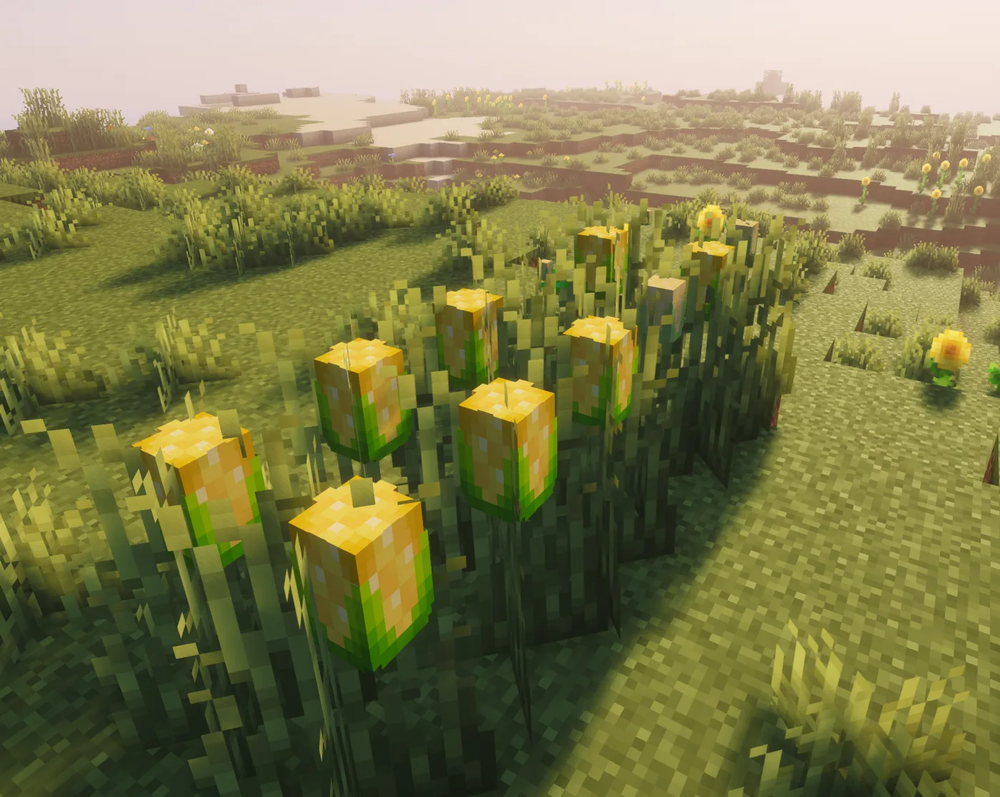
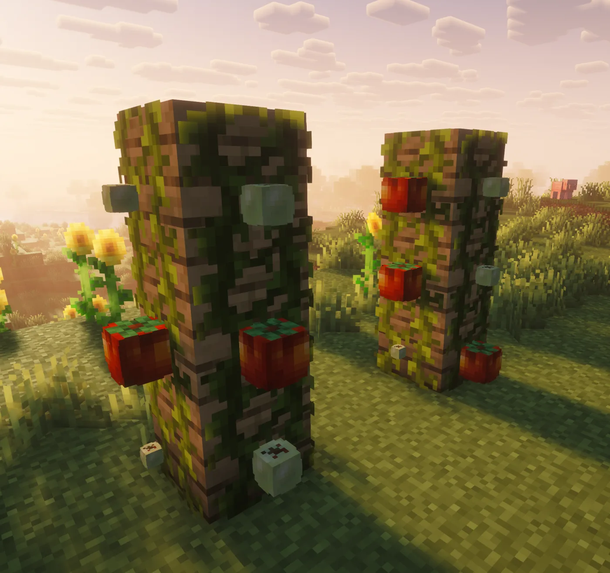
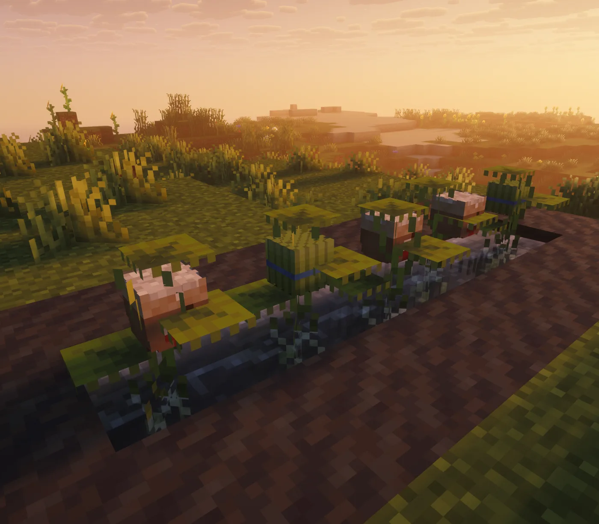

# Gardening

<figure class="hl-figure">
  
  <figcaption>Heirloom crops use custom display visuals and growth stages.</figcaption>
</figure>

Core crops are Lettuce, Onion, Corn, Tomato, and Rice. Addons can register additional crops, such as Distillery grapes and Cafe coffee cherries.

## Crop Gallery

  <figure class="hl-media-card"><figcaption>Lettuce: Short ground crop.</figcaption></figure>
  <figure class="hl-media-card"><figcaption>Onion: Allium-style ground crop.</figcaption></figure>
  <figure class="hl-media-card"><figcaption>Corn: Tall crop with vertical room.</figcaption></figure>
  <figure class="hl-media-card"><figcaption>Tomato: Wall vine crop.</figcaption></figure>
  <figure class="hl-media-card"><figcaption>Rice: Aquatic crop planted in water.</figcaption></figure>

## What A Crop Is

A crop is a real block plus a display entity and stored data. The block gives Minecraft something to protect, break, and interact with; the display gives Heirloom its custom visual stages; stored data tracks crop ID, growth state, facing, and optional quality.

## The Growth Loop

1. Obtain a crop item or seed packet.
2. Plant it on a valid block for its plant type.
3. Let the growth timer advance through stages.
4. Right-click the mature crop to harvest.
5. If `replant_after_harvest` is enabled, the crop resets to an early stage instead of disappearing.

## Crop Types At A Glance

- Lettuce is the simplest short ground crop.
- Onion uses allium-style placement.
- Corn is a tall crop and needs vertical room.
- Tomato is a vine and needs a wall face.
- Rice is aquatic and needs water above valid soil.

## Quality And Drops

Harvest settings define normal drops, bonus drops, replanting, sounds, and quality chance. Fortune can improve configured bonus drops, and compatible custom enchantments can add effective Fortune or force replanting.

## Acquisition

Survival access comes from grass drops, seed packets, chest loot, and natural patches. World generation and chest loot only affect new content, so old worlds may need starter items, seed packets, or admin seeding.
